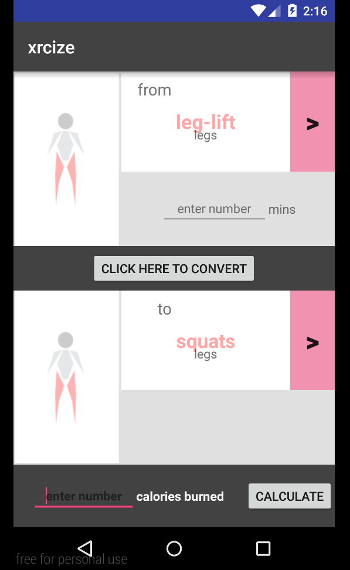
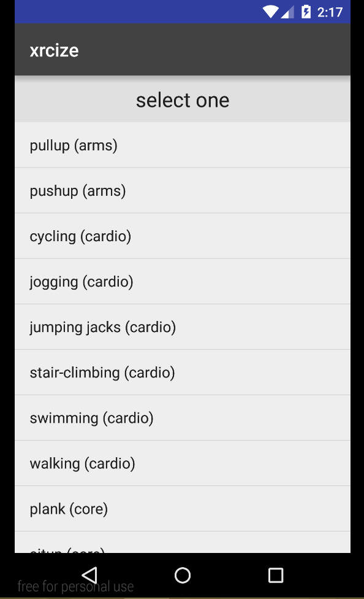
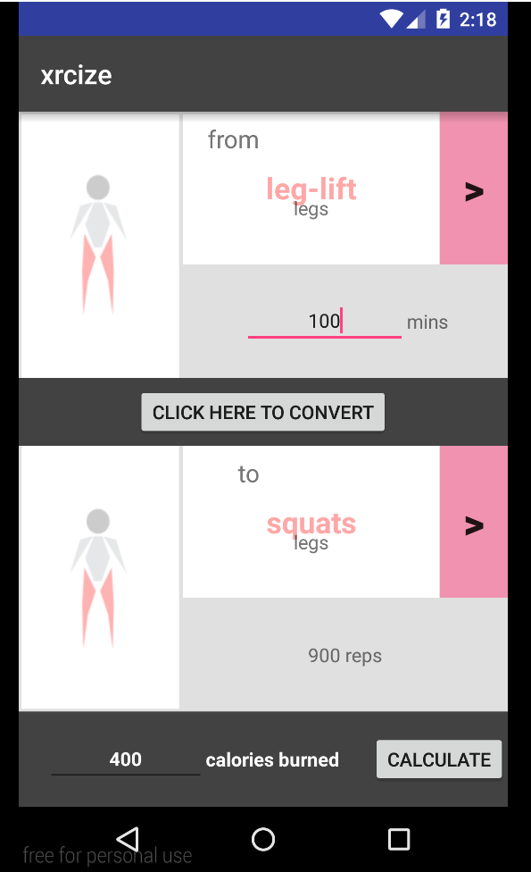

# PROG 01: Crunch Time

xrcise is a simple calorie converter for active people who want to know the equivalence of one activity vs another in calorie burn.

## Authors

Caryn Tran ([caryn.tran@berkeley.edu](mailto:caryn.tran@berkeley.edu))

## Demo Video

See [CS160 PROJ1 DEMO: xrcize] (https://www.youtube.com/watch?v=am7uVKxEDpY)

## Screenshots

## Acknowledgments

* Hat tip to anyone who's code was used
* Any other support

*Feel free to enhance your README. For Markdown syntax, see [the GitHub Guides](https://guides.github.com/features/mastering-markdown/). Remove this line in your submission.*
